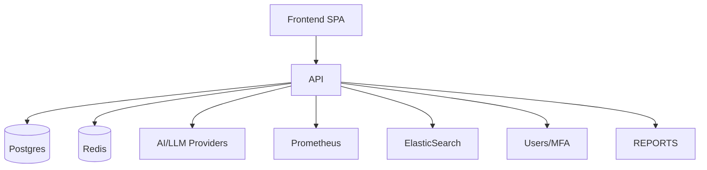

# JADE Ultimate Security Platform - Architecture

## Overview

JADE Ultimate is a modern, scalable, cloud-native security platform with a microservice-ready backend, React SPA frontend, and advanced AI/LLM integrations.

## Main Components

- **Backend:** FastAPI, async PostgreSQL, Redis (for cache, rate limiting), Prometheus metrics
- **Frontend:** React + Ant Design, modern UX, secure JWT auth, API-first
- **AI/LLM Integration:** GPT-4, Claude-3, Gemini, Together, etc.
- **Deployment:** Docker, Kubernetes, Helm, Terraform, scalable and observable
- **Observability:** Prometheus, Grafana, ELK for logs

## Security

- AES-256 encryption
- Role-based access (RBAC), MFA, audit logs
- Rate limiting, secure HTTP headers, CSP
- Compliance: GDPR, ISO 27001, SOC 2

## Data Flow

1. **User** interacts via SPA frontend (HTTPS).
2. **API** (FastAPI) handles JWT authentication, RBAC, audit, scan orchestration, AI analysis.
3. **Database** (PostgreSQL) stores all state, scan results, vulnerabilities.
4. **AI/LLM Services** are called via secure service adapters.
5. **Reports/Dashboards** are aggregated and displayed to user.

## Diagrams

---

See also:
- [DEPLOYMENT.md](DEPLOYMENT.md)
- [API.md](API.md)